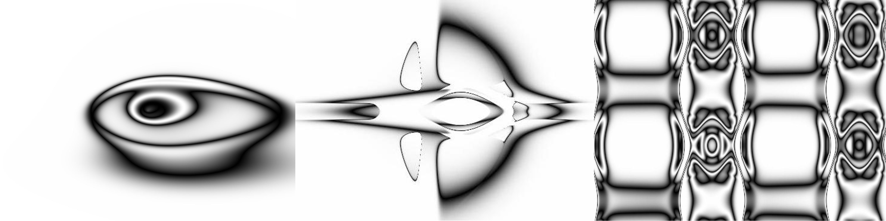
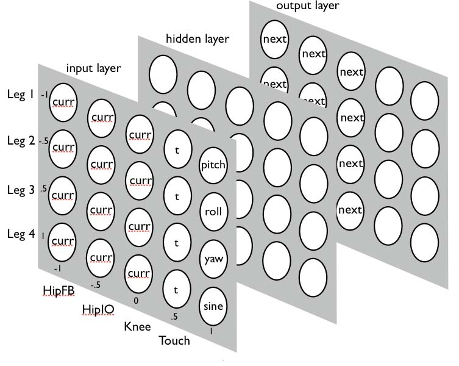
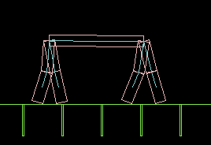
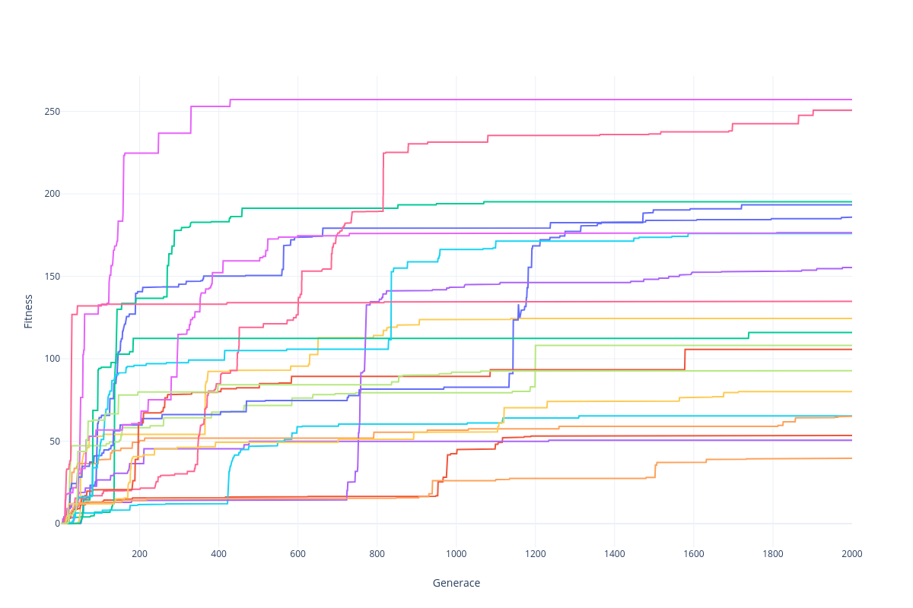

## Crawler - chodící robot pomocí HyperNEAT

### Jan Bouček, FIT ČVUT

Upozornění: tato dokumentace je z velké části pouze zkrácená, aktualizovaná a pro BI-ZUM upravená verze původní dokumentace ([zde](https://github.com/Colanderr/Crawler/blob/master/documentation/crawler.pdf)) odevzdané jako součást maturitní práce, která detailněji popisuje jednotlivé využité techniky. 

### Cíl projektu

Cílem projektu je vyvinout ovladač simulovaného čtyřnohého 2D robota, který dosahuje co nejrychlejší plynulé chůze v jednom směru, pomocí HyperNEAT.

Chůzi lze definovat jakožto sérii stavů kráčivého tělesa, kde každý stav lze zjednodušit jako soubor informací popisujících jednotlivé pohyblivé prvky robota. V rámci tohoto projektu budeme pracovat s dvojrozměrnou simulací čtyřnohého robota, jehož každá noha je ovládána dvěma klouby. Stav robota tak lze vystihnout jako osmirozměrný vektor $\vec{s}$. Hledáme pak ovladač robota, který pro každý stav malezne osmirozměrný vektor $\vec{\omega}$, ten každému kloubu určuje úhlovou rychlost.

### Využitá teorie

#### NEAT

*Neuroevolution of augmenting topologies* ([ref](http://www.mitpressjournals.org/doi/10.1162/106365602320169811)) - NEAT - je metodou, která definuje jeden ze způsobů, kterými lze vyvíjet neuronové sítě pomocí evolučního algoritmu. Ideou tohoto systému je způsob, kterým zapisuje neuronové sítě, jakožto *živočichy* v genetickém algoritmu.
Tento systém každou neuronovou síť popisuje jako ohodnocený graf pomocí dvou seznamů *genů* - seznamu vrcholů a seznamu hran. Každému vrcholu a hraně přisuzuje číselné identifikátory, pomocí kterých dokáže udržovat přehled o tom, kteří jedinci jsou si *geneticky* podobní.
Stanley a Miikkulainen  díky tomu zavádí i proces *speciace*, který ještě před rozmnožováním roztřídí jedince na různé *druhy* podle příbuznosti tak, aby se spolu křížily jen sítě s menšími rozdíly. Každý druh je pak ohodnocen svojí průměrnou hodnotou fitness, pomocí které se určí počet potomků v další generaci daného druhu.
Při procesu rozmnožování je z každého druhu vybrána *silnější* část, ze které se vytvoří požadovaný počet potomků, z nichž každý může vzniknout křížením - většinu genů zdědí po silnějším rodiči, ale část od slabšího, nebo bez křížení, kdy se jedinec pouze zkopíruje do další generace.
Pak na všech potomcích proběhnou mutace, přičemž je náhodně rozhodnuto, které z druhů mutací na nich proběhnou, Stanley a Miikkulainen jich popisují hned několik:

- přidání nové hrany do sítě
- rozdělení hrany na dvě hrany s novým neuronem uprostřed
- změna všech vah o~malou hodnotu, nebo na náhodnou hodnotu

Po zmutování jsou všichni potomci prohlášeni za současnou generaci a algoritmus pokračuje znovu hodnocením jedinců.

#### CPPN-NEAT

Tím, že v NEAT algoritmu umožníme každému neuronu využívat jinou aktivační funkci, můžeme dosáhnout tvorby sítí, které jsou dobře uzpůsobené ke generování fyzické geometrie živočichů. Metoda CPPN-NEAT ([ref](http://link.springer.com/10.1007/s10710-007-9028-8)) využívá různých vlastností funkcí - symetrie, repetice apod. tak, že průchodem celou sítí jsou výsledná data nakombinována pomocí komplexní složené funkce, která si uchováva všechny tyto vlastnosti.
Pokud například vytvoříme CPPN síť s dvěma vstupy - souřadnicemi $x$ a $y$ s jedním výstupem, získáme dvojrozměrné útvary (viz obr. níže), které mají velmi blízko k fyzickému rozložení v reálných živočiších, např. dokáže nakombinovat repetici s variací a generovat útvary podobné prstům ruky nebo pomocí symetrie a variace útvar podobný lidskému oku (viz obr. níže).
V samotném algoritmu stačí jen při tvoření nových neuronů určit náhodnou aktivační funkci a přidat mutační operátor, který změní funkci u náhodného neuronu.

#### HyperNEAT

Technika HyperNEAT ([ref](http://www.mitpressjournals.org/doi/10.1162/artl.2009.15.2.15202)) využívá CPPN sítě ke generování čtyřrozměrného prostoru, který ve výsledku slouží jako definice vah v další neuronové síti.  Tzn. "organická struktura", kterou generujeme pomocí CPPN-NEAT je *mozek*.
To znamená, že generujeme CPPN síť, která má čtyři vstupy - $x_1$, $y_1$, $x_2$, $y_2$. Výstup nám pak určuje váhu spoje z neuronu na *fyzických* souřadnicích $[x_1;y_1]$ do neuronu na souřadnicích $[x_2;y_2]$. Stačí nám pak navrhnout *fyzickou* strukturu sítě k využití této techniky.
V tomto projektu je použito rozložení zvané *state-space sandwich* ([ref](http://ieeexplore.ieee.org/document/4983289/)) o třech vrstvách podobně jako v referovaném článku, kde výsledná síť je rozvrstvená do trojrozměrného prostoru a z každého neuronu vede spoj do každého neuronu v další vrstvě. CPPN síť má pak dva výstupy, kde první určuje váhu mezi souřadnicemi $[x_1;y_1]$ z první vrstvy do $[x_2;y_2]$ v druhé a druhý výstup určuje stejným způsobem váhy mezi druhou a třetí vrstvou.

### Implementace

Projekt je implementován v jazyce Kotlin (původní verze byla v Javě), byl vybrán zejména pro dobrou objektovou strukturu a protože se mi v něm programuje nejpohodlněji. V následním textu je popsáno, jak jednotlivé komponenty projektu fungují a jaké všechny vylepšení jsem vystavěl na základním algoritmu.

Program zkouší evoluci 20 krát s různým seedem generátoru náhodných čísel. 

#### NEAT

NEAT je impementován velmi blízko tomu, jak byl výše popsán. Kromě několika základních jsem ještě přidal několik dalších mutačních operátorů:

- aktivace/deaktivace jedné hrany
- změna jedné váhy na náhodnou hodnotu
- změna jedné váhy o~maximálně $\pm 5\%$

Díky této malé úpravě dokáže algoritmus ladit neuronovou síť v mírně detailnějším měřítku. 

#### HyperNEAT

HyperNEAT je také implementován docela standardním způsobem. Největší otázkou bylo, jak v *state-space sandwich* rozmístit neurony. 

Na rozdíl od klasických neuronových sítí jsou si sítě generované HyperNEATem vědomé geometrických souvislostí  ([ref](http://www.mitpressjournals.org/doi/10.1162/artl.2009.15.2.15202)). Clune et al. ([ref](http://ieeexplore.ieee.org/document/4983289/)) umisťuje do každého řádku v *substrátu* jednu nohu a do posledního sloupce přidává neuspořádaně zbývající informace:

Tento postup sice dává geometricky najevo související buňky - podobné informace jsou ve stejných sloupcích, ale opomíjí rozložení nohou v prostoru, proto se v tomto projektu používá struktura, která za pomoci symetrie dává najevo souvislosti typu *přední/zadní pár nohou* a *levá/pravá noha*. Pro nejlepší výsledky je v rozložení nohou středová souměrnost a zbývající informace jsou v prostřední řadě mezi nohama (viz obr. 3). Každá noha je popsána pomocí dvou úhlů kloubů (označeno $\phi$) a dotykového *senzoru* (vstup označený $T$) na spodním článku nohy, jehož hodnota je nastavena na $-1$ bez dotyku a $1$ s dotykem, pro plynulost pohybu mají tyto hodnoty lineární přechod o délce 25 snímků.
Jako přídavné proměnné jsou v~tomto rozložení $sin(t/\tau)$, $cos(t/\tau)$, kde $\tau$ je experimentálně určená konstanta 40, dále úhel těla robota se zemí $\Phi$ a $1$ jakožto lineární konstanta.
Z výstupní vrstvy jsou využívány pouze neurony v pozicích úhlů nohou, které jsou převedeny na úhlovou rychlost podobně jako v ([ref](http://ieeexplore.ieee.org/document/4983289/)): $\omega = 4,5\cdot(\phi_{new} - \phi_{cur})$.

Pro ilustraci této struktury poslouží následující obrázek:

*symetrické rozložení sítě, barvy označují jednotlivé nohy, vlevo vstupní vrstva, vpravo výstupní vrstva, prostřední skrytá vrstva nevyobrazena*

#### Simulace

K simulaci je použita knihovna JBox2D ([ref](http://www.jbox2d.org/)), která poskytuje v celku věrohodný model dvojrozměrného světa, ale bohužel nesimuluje úplně deterministicky, takže každý běh programu se ve výsledcích liší. 

Robot se skládá z hlavního těla, na které jsou napojeny nohy (viz obr níže) . Každá z nich je napojena pomocí rotujícího *RevoluteJointu* a stejným způsobem je napojen i spodní segment v koleni.

Měření vzdálenosti probíhá 3000 snímků při 60 snímcích za sekundu a dalších 1500 snímků se čeká, jestli robot po konci měření upadne na zem. Tím se zabraňuje strategiím, kdy místo snahy o chůzi robot pouze skočí směrem kupředu.

Výsledná vzdálenost se přímo využívá jako fitness v evolučním algoritmu, pokud robot upadl, počítá se jako $0$.

### Výsledky

Nejlepším výsledkem programu je ovladač robota, který je schopen během 3000 snímků ujít 257 délkových jednotek. Výsledá "chůze" je ale ve skutečnosti spíše skákaní, které sice nebylo původním cílem, ale v rámci daných pravidel je zřejmě efektvnější než opravdová chůze. 

U několika ovladačů se ale opravdu vyvinulo něco, co se za chůzi považovat dá, nejlepší takový ovladač dosahuje vzdálenosti 195. K lidské, či zvířecí chůzi ale chybí jedna zásadní vlastnost - při chůzi nezvedá nohy. K tomu dochází zejména z toho důvodu, že při chůzi na úplně hladkém povrchu k tomu ani není důvod a stálý kontakt se zemí mu dodává další stabilitu.

<video src="../images/bunny.mkv"></video>

*nejlepší výsledek*

<video src="../images/walk.mkv"></video>

*výsledek s chůzí*

*průběh vývoje fitness podle generace napčíč všemi 20 běhy*

